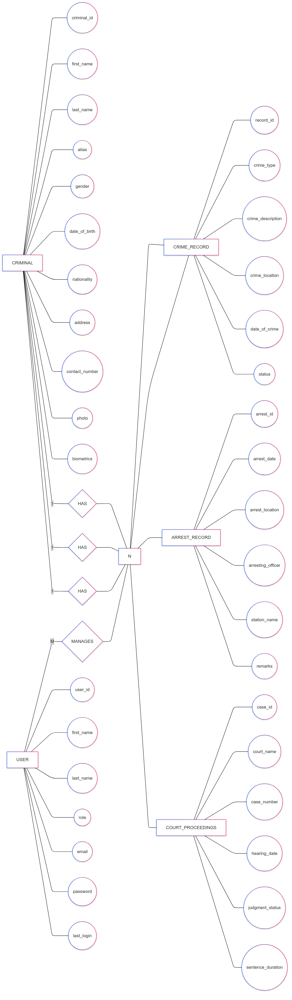

***<p style="text-align:center;">DATABASE MANAGEMENT SYSTEM LABORATORY</p>***
<p style="text-align:center;">MINI PROJECT</p>
<p style="text-align:center;">SYNOPSIS</p> 

**Title of the Project: - Criminal Database System**

**Abstract:**  
This project presents the development of a *criminal database system* designed to efficiently store and manage criminal records. The system allows authorized personnel to *add new criminal profiles, including personal information, crime history, and other relevant data. Additionally, the database provides search functionality, enabling users to quickly locate and retrieve details of criminals whose names or profiles are already stored. This tool aims to enhance law enforcement operations by providing a centralized and accessible repository of criminal data*, facilitating faster investigations and decision-making processes. The system ensures data accuracy, consistency, and security, making it a reliable resource for maintaining records and improving public safety.**

---

### 1. *Criminal*  
- *criminal_id* (Primary Key)  
- *first_name*  
- *last_name*  
- *alias* (Other known names)  
- *gender*  
- *date_of_birth*  
- *nationality*  
- *address*  
- *contact_number*  
- *photo* (Image file or path)  
- *biometrics* (Fingerprint or facial data)  

---

### 2. *Crime Record*  
- *record_id* (Primary Key)  
- *criminal_id* (Foreign Key)  
- *crime_type* (e.g., theft, assault, fraud)  
- *crime_description*  
- *crime_location*  
- *date_of_crime*  
- *status* (Pending, Convicted, Released)  

---

### 3. *Arrest Record*  
- *arrest_id* (Primary Key)  
- *criminal_id* (Foreign Key)  
- *arrest_date*  
- *arrest_location*  
- *arresting_officer_name*  
- *station_name*  
- *remarks*  

---

### 4. *Court Proceedings*  
- *case_id* (Primary Key)  
- *criminal_id* (Foreign Key)  
- *court_name*  
- *case_number*  
- *hearing_date*  
- *judgment_status* (Ongoing, Convicted, Acquitted)  
- *sentence_duration* (If convicted)  

---

### 5. *User (Admin/Officer)*  
- *user_id* (Primary Key)  
- *first_name*  
- *last_name*  
- *role* (Admin, Officer)  
- *email*  
- *password*  
- *last_login*  

---
```sql
CREATE TABLE Criminal (
    criminal_id INT AUTO_INCREMENT PRIMARY KEY,
    first_name VARCHAR(50) NOT NULL,
    last_name VARCHAR(50) NOT NULL,
    alias VARCHAR(100),
    gender ENUM('Male', 'Female', 'Other') NOT NULL,
    date_of_birth DATE NOT NULL,
    nationality VARCHAR(50) NOT NULL,
    address TEXT,
    contact_number VARCHAR(15),
    photo BLOB,
    biometrics BLOB
);

```
```sql
CREATE TABLE Crime_Record (
    record_id INT AUTO_INCREMENT PRIMARY KEY,
    criminal_id INT NOT NULL,
    crime_type VARCHAR(50) NOT NULL,
    crime_description TEXT,
    crime_location VARCHAR(100) NOT NULL,
    date_of_crime DATE NOT NULL,
    status ENUM('Pending', 'Convicted', 'Released') NOT NULL,
    FOREIGN KEY (criminal_id) REFERENCES Criminal(criminal_id) ON DELETE CASCADE
);
```

```sql
CREATE TABLE Arrest_Record (
    arrest_id INT AUTO_INCREMENT PRIMARY KEY,
    criminal_id INT NOT NULL,
    arrest_date DATE NOT NULL,
    arrest_location VARCHAR(100) NOT NULL,
    arresting_officer_name VARCHAR(100) NOT NULL,
    station_name VARCHAR(100) NOT NULL,
    remarks TEXT,
    FOREIGN KEY (criminal_id) REFERENCES Criminal(criminal_id) ON DELETE CASCADE
);
```
```sql
CREATE TABLE Court_Proceedings (
    case_id INT AUTO_INCREMENT PRIMARY KEY,
    criminal_id INT NOT NULL,
    court_name VARCHAR(100) NOT NULL,
    case_number VARCHAR(50) UNIQUE NOT NULL,
    hearing_date DATE NOT NULL,
    judgment_status ENUM('Ongoing', 'Convicted', 'Acquitted') NOT NULL,
    sentence_duration INT,
    FOREIGN KEY (criminal_id) REFERENCES Criminal(criminal_id) ON DELETE CASCADE
);
```
```sql
CREATE TABLE User (
    user_id INT AUTO_INCREMENT PRIMARY KEY,
    first_name VARCHAR(50) NOT NULL,
    last_name VARCHAR(50) NOT NULL,
    role ENUM('Admin', 'Officer') NOT NULL,
    email VARCHAR(100) UNIQUE NOT NULL,
    password VARCHAR(255) NOT NULL,
    last_login TIMESTAMP
);
```
<p style="text-align: center">

<span>Schema Diagram</span>
</p>
<p style="text-align: center">

<span>Entity Relationship Diagram</span>
</p>